# 学习笔记-文添

## CNN介绍

### 卷积神经网络（CNN）的组成

一个卷积神经网络由以下部分组成

> - 数据输入层
> - 卷积层
> - 池化层
> - 全连接层

下面为大家逐一讲解每一层的含义以及怎么构成最终的卷积神经网络的

#### 1、数据输入层

该层要做的就是对数据进行预处理其中包括

> - 去均值：将数据维度中心都化为0，本质就是把数据拉回坐标原点上
> - 归一化：幅度归一化到同样的范围，如下所示，即减少各维度数据取值范围的差异而带来的干扰，比如，我们有两个维度的特征A和B，A范围是0到10，而B范围是0到10000，如果直接使用这两个特征是有问题的，好的做法就是归一化，即A和B的数据都变为0到1的范围。
> - 降维：用PCA降维数据各个特征轴上的幅度归一化

去均值与归一化效果图

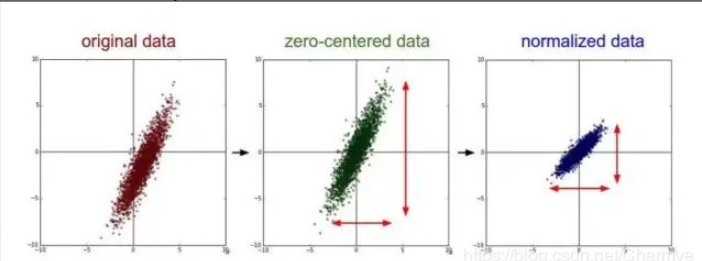

**数据预处理很重要，有时候数据处理完再运行程序速度会变快，对于神经网络的权重初始化也十分的重要，我们以数据归一化为例，我自己直观地理解就是原式：2000+1000和归一化后的式子：2+1，计算量对于刚学数学的人来说肯定是不一样的**

#### 2、卷积层

卷积层包括以下三个部分

> - 原始图像
> - 卷积核
> - 卷积变换

##### 原始图像

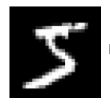

用opencv对图像进行读取，计算机所看到的图像其实是这个样子的（理想化，比不一定真的是这样的，我就是抽象出来方便大家理解）

##### 卷积核

其次介绍的是卷积核，可以直观的看到卷积核就是一个矩阵（暂时大家理解为矩阵就可以，我后面的讲解里会把所有的部分都串起来）

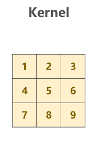

##### 卷积变化

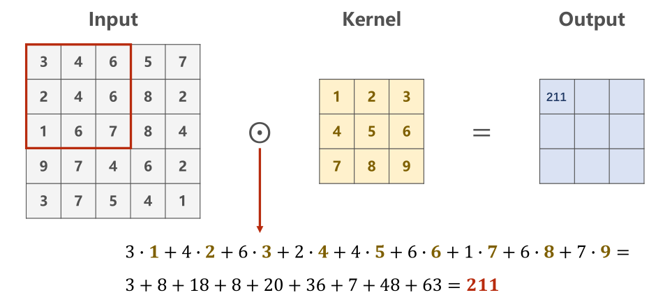

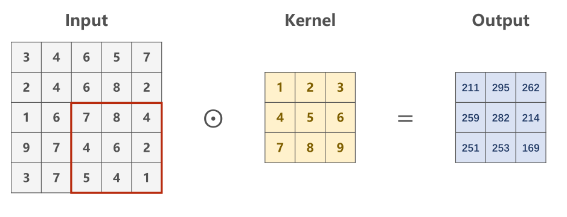

通过卷积变化我们原来5的图片矩阵变成了更小，特征更加明显的数组（这里补充一下计算机图像二值化之后数值一般都在0-255，数值越小像素点越白，数值越大像素点越黑，本文图片中也对于这一点，至于为什么多出255了，是因为卷积核没有选好）

##### **那么这时候大家应该脑海里会有这些问题：**

> **1、卷积核是干什么的呢？** 
>
> **2、我们需要卷积层干嘛呢? **
>
> **3、普通的神经网络不可以做学习吗?**

1、卷积核是干什么的？

> 广泛来说卷积核就是对图像进行方块化计算，更好的找到图像之间关联性的一种方式

2、我们需要卷积层来干嘛呢？

> 对照片的特征值进行提取，比如说我想识别蚂蚁和蜜蜂，对蚂蚁的图像进行卷积之后，我们有可能会得到蚂蚁的触角、蚂蚁的腿、蚂蚁的外壳。对蜜蜂的图像进行卷积之后我们会得到蜜蜂的翅膀、蜜蜂的外壳绒毛、蜜蜂的触角、蜜蜂的腿

3、普通的神经网络不可以做学习吗?

> 可以，但是普通的神经网络是对一个图像进行展开，比如说100*100像素点的图像，普通神经网络只能学习线性的关系也就是当前的和后几个的关联性，而卷积神经网络可以学习到卷积核内图像的关联性，更好满足特征识别，模式识别的要求。

下面展示一下卷积之后全连接图像的样子(这是边缘检测的结果，卷积核满足边缘检测卷积核，卷积核样子为3*3的矩阵[-1,0,1；-2,0,2；-1,0,1]    matlab矩阵表示)

### 3、池化层

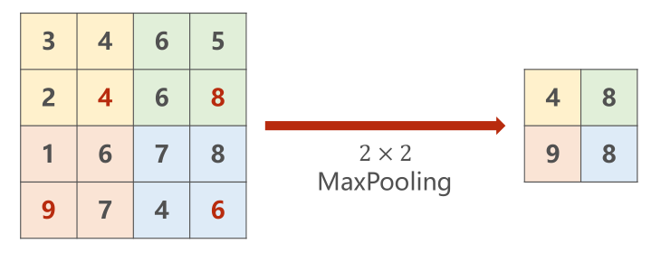

个人理解池化层的目的就是进一步对图像的特征值进行提取，舍去数据矩阵当中冗余的部分

因为图像像素点像素点之间的关联性是很强的，邻像素倾向于具有相似的值。比如说眼球是黑色的占4个像素点（255,255,255,255），那我们没有必要全部都要，只需要取一个像素点255就可以了

池化层就是这个目的，只取规定矩阵中最大的那个数，舍去数据矩阵当中冗余

### 4、全连接层

我直观的理解全连接层就是将我们卷积出来的图像进行重新的拼接，进行分类（**以下内容建立在权重都学习会了的层面上**）

现在假设神经网络训练完毕，关于小猫咪的特征我们已经知道，当我们得到下图的特征的时候，就可以判断是猫了（特征都是卷积出来了，图像卷积核卷出来的）

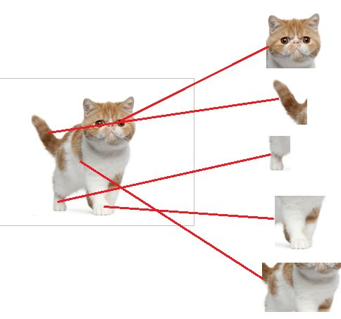

红色代表神经元已经找到了这些特征（俗称激活了）

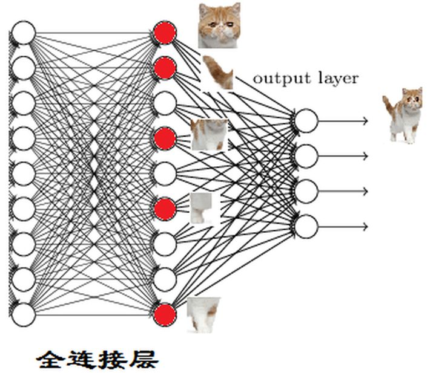

这细节特征又是怎么来的？就是从前面的卷积层来的

## FCN介绍

CNN网络是在卷积层之后接上若干个全连接层，将卷积层产生的特征图映射成一个固定长度的特征向量。

以AlexNet为代表的经典CNN结构适合于图像级的分类和回归任务，因为它们最后都期望得到整个输入图像的一个数值描述（概率），比如AlexNet的ImageNet模型输出一个1000维的向量表示输入图像属于每一类的概率(softmax归一化)。

栗子：下图中的猫, 输入AlexNet, 得到一个长为1000的输出向量, 表示输入图像属于每一类的概率, 其中在“tabby cat”这一类统计概率最高。

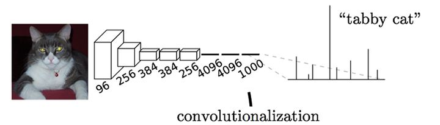

与经典的CNN在卷积层之后使用全连接层得到固定长度的特征向量进行分类（全连接层+Softmax层）不同，FCN可以接受任意尺寸的输入图像，采用反卷积层对最后一个卷积层的特征图进行上采样，使它恢复到原尺寸的图像，从而可以对每一个像素都产生一个预测，同时保留了原始输入图像中的空间信息，最后在上采样的特征图上进行像素分类。

最后逐个像素计算Softmax分类的损失，相当于每一个像素对应一个训练样本。

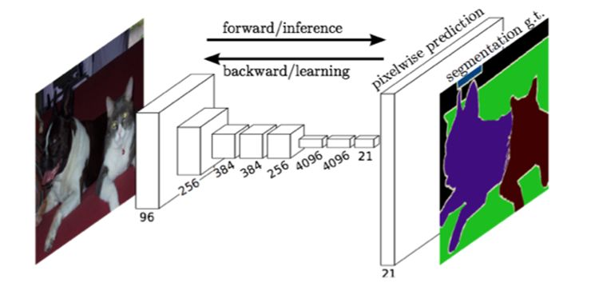

简单的来说，FCN与CNN的区别在于CNN最后的全连接层换成卷积层，输出的是一张已经Label好的图片

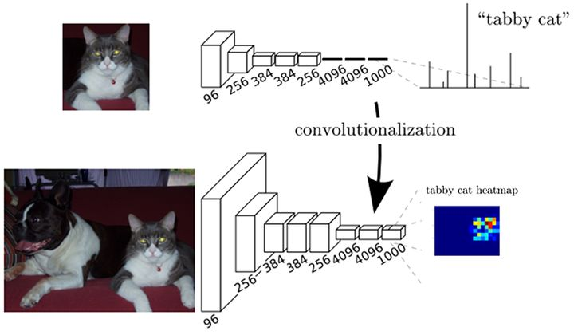

